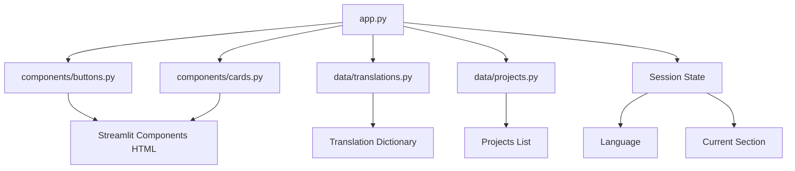
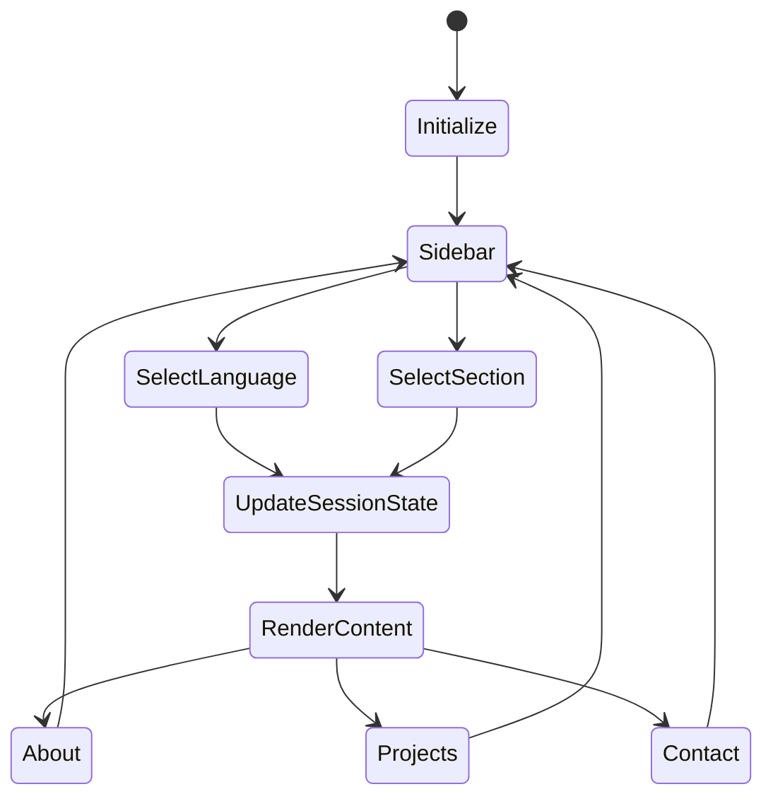
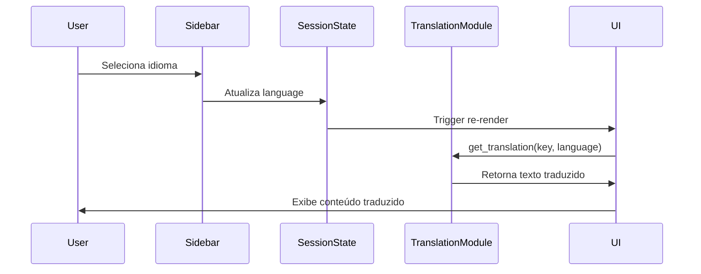

# Documento de Design

## Visão Geral

O portfólio será uma aplicação web single-page desenvolvida com Streamlit, utilizando Python como linguagem principal. A arquitetura seguirá o padrão de componentes do Streamlit, com separação clara entre dados, lógica de apresentação e componentes de UI. A aplicação será stateful através do session_state do Streamlit, permitindo navegação fluida e persistência de preferências do usuário durante a sessão.

O portfólio incluirá seis seções principais: Sobre, Projetos, Mentoria, Recomendações, Conteúdos e Contato, todas acessíveis através de um menu lateral com suporte a múltiplos idiomas (Português e Inglês).

## Arquitetura

### Estrutura de Arquivos

```
portfolio-streamlit/
├── app.py                 # Arquivo principal da aplicação
├── components/
│   ├── __init__.py
│   ├── buttons.py        # Componentes de botões customizados
│   └── cards.py          # Componentes de cards de projetos
├── data/
│   ├── __init__.py
│   ├── translations.py   # Dicionários de tradução
│   ├── projects.py       # Dados dos projetos
│   ├── mentorship.py     # Dados de mentoria
│   ├── recommendations.py # Dados de recomendações
│   └── content.py        # Dados de conteúdos (artigos, vídeos, etc.)
├── assets/
│   └── profile.jpg       # Imagem de perfil
├── requirements.txt      # Dependências Python
└── README.md            # Documentação
```

### Fluxo de Dados

```
User Input (Sidebar) → Session State → Content Renderer → Display
                ↓
         Language Selector → Update Translations → Re-render
```

## Componentes e Interfaces

### 1. Componente Principal (app.py)

**Responsabilidades:**
- Configurar a página Streamlit
- Gerenciar o estado da sessão
- Renderizar o sidebar
- Coordenar a exibição de conteúdo baseado na navegação

**Interface:**
```python
def main() -> None:
    """Função principal que inicializa e executa a aplicação"""
    
def setup_page() -> None:
    """Configura as propriedades da página Streamlit"""
    
def initialize_session_state() -> None:
    """Inicializa variáveis de estado da sessão"""
    
def render_sidebar() -> str:
    """Renderiza o menu lateral e retorna a seção selecionada"""
    
def render_content(section: str, language: str) -> None:
    """Renderiza o conteúdo da seção selecionada no idioma escolhido"""
```

### 2. Componente de Botões (components/buttons.py)

**Responsabilidades:**
- Criar botões HTML customizados com estilo
- Gerenciar links externos

**Interface:**
```python
def create_custom_button(
    text: str,
    url: str,
    background_color: str = "#0066cc",
    text_color: str = "#ffffff",
    border_radius: str = "5px"
) -> None:
    """
    Cria um botão HTML customizado que abre URL em nova aba
    
    Args:
        text: Texto exibido no botão
        url: URL de destino
        background_color: Cor de fundo do botão
        text_color: Cor do texto
        border_radius: Raio da borda
    """
```

### 3. Componente de Cards (components/cards.py)

**Responsabilidades:**
- Exibir informações de projetos em formato de card
- Organizar layout de múltiplos projetos

**Interface:**
```python
def render_project_card(
    title: str,
    description: str,
    technologies: list[str],
    url: str,
    language: str
) -> None:
    """
    Renderiza um card de projeto com informações formatadas
    
    Args:
        title: Título do projeto
        description: Descrição do projeto
        technologies: Lista de tecnologias utilizadas
        url: Link para o projeto
        language: Idioma atual para tradução de labels
    """

def render_projects_grid(projects: list[dict], language: str) -> None:
    """
    Renderiza múltiplos projetos em layout de grid
    
    Args:
        projects: Lista de dicionários com dados dos projetos
        language: Idioma atual
    """
```

### 4. Módulo de Traduções (data/translations.py)

**Responsabilidades:**
- Armazenar todas as strings traduzidas
- Fornecer acesso às traduções por chave e idioma

**Interface:**
```python
TRANSLATIONS: dict[str, dict[str, str]] = {
    "pt": {
        "nav_about": "Sobre",
        "nav_projects": "Projetos",
        "nav_mentorship": "Mentoria",
        "nav_recommendations": "Recomendações",
        "nav_content": "Conteúdos",
        "nav_contact": "Contato",
        # ... mais traduções
    },
    "en": {
        "nav_about": "About",
        "nav_projects": "Projects",
        "nav_mentorship": "Mentorship",
        "nav_recommendations": "Recommendations",
        "nav_content": "Content",
        "nav_contact": "Contact",
        # ... mais traduções
    }
}

def get_translation(key: str, language: str) -> str:
    """
    Retorna a tradução para uma chave no idioma especificado
    
    Args:
        key: Chave da tradução
        language: Código do idioma ('pt' ou 'en')
    
    Returns:
        String traduzida ou chave original se não encontrada
    """
```

### 5. Módulo de Projetos (data/projects.py)

**Responsabilidades:**
- Armazenar dados estruturados dos projetos
- Fornecer acesso aos dados dos projetos

**Interface:**
```python
PROJECTS: list[dict] = [
    {
        "title": {"pt": "Título PT", "en": "Title EN"},
        "description": {"pt": "Descrição PT", "en": "Description EN"},
        "technologies": ["Python", "Streamlit", "Pandas"],
        "url": "https://github.com/user/project"
    },
    # ... mais projetos
]

def get_projects() -> list[dict]:
    """Retorna a lista de todos os projetos"""
```

### 6. Módulo de Mentoria (data/mentorship.py)

**Responsabilidades:**
- Armazenar informações sobre serviços de mentoria
- Fornecer dados sobre disponibilidade e áreas de mentoria

**Interface:**
```python
MENTORSHIP_INFO: dict = {
    "description": {
        "pt": "Descrição dos serviços de mentoria em português",
        "en": "Description of mentorship services in English"
    },
    "areas": [
        {"pt": "Área 1 PT", "en": "Area 1 EN"},
        {"pt": "Área 2 PT", "en": "Area 2 EN"}
    ],
    "availability": {"pt": "Disponibilidade PT", "en": "Availability EN"},
    "contact_url": "https://calendly.com/user"
}

def get_mentorship_info() -> dict:
    """Retorna informações de mentoria"""
```

### 7. Módulo de Recomendações (data/recommendations.py)

**Responsabilidades:**
- Armazenar recomendações do profissional sobre livros, cursos, ferramentas
- Fornecer acesso a recomendações categorizadas

**Interface:**
```python
RECOMMENDATIONS: list[dict] = [
    {
        "title": {"pt": "Título PT", "en": "Title EN"},
        "category": "book",  # book, course, tool, article, etc.
        "description": {"pt": "Descrição PT", "en": "Description EN"},
        "author_creator": "Nome do Autor/Criador",
        "url": "https://link-to-resource.com",
        "reason": {"pt": "Por que recomendo PT", "en": "Why I recommend EN"}
    },
    # ... mais recomendações
]

def get_recommendations(category: str = None) -> list[dict]:
    """
    Retorna lista de recomendações, opcionalmente filtradas por categoria
    
    Args:
        category: Categoria para filtrar (opcional)
    """
```

### 8. Módulo de Conteúdos (data/content.py)

**Responsabilidades:**
- Armazenar links para artigos, vídeos e outros conteúdos
- Categorizar conteúdos por tipo

**Interface:**
```python
CONTENTS: list[dict] = [
    {
        "title": {"pt": "Título PT", "en": "Title EN"},
        "description": {"pt": "Descrição PT", "en": "Description EN"},
        "type": "article",  # article, video, podcast, etc.
        "url": "https://medium.com/@user/article",
        "date": "2024-01-15",
        "tags": ["Python", "Data Science"]
    },
    # ... mais conteúdos
]

def get_contents(content_type: str = None) -> list[dict]:
    """
    Retorna lista de conteúdos, opcionalmente filtrados por tipo
    
    Args:
        content_type: Tipo de conteúdo para filtrar (opcional)
    """
```

## Modelos de Dados

### Session State

```python
{
    "language": str,        # Idioma selecionado: "pt" ou "en"
    "current_section": str  # Seção atual: "about", "projects", "mentorship", "recommendations", "content", "contact"
}
```

### Project Data Model

```python
{
    "title": {
        "pt": str,  # Título em português
        "en": str   # Título em inglês
    },
    "description": {
        "pt": str,  # Descrição em português
        "en": str   # Descrição em inglês
    },
    "technologies": list[str],  # Lista de tecnologias
    "url": str                  # URL do projeto
}
```

### Mentorship Data Model

```python
{
    "description": {
        "pt": str,  # Descrição em português
        "en": str   # Descrição em inglês
    },
    "areas": list[dict],  # Lista de áreas de mentoria com traduções
    "availability": {
        "pt": str,  # Disponibilidade em português
        "en": str   # Disponibilidade em inglês
    },
    "contact_url": str  # URL para agendamento
}
```

### Recommendation Data Model

```python
{
    "title": {
        "pt": str,  # Título em português
        "en": str   # Título em inglês
    },
    "category": str,    # Categoria: "book", "course", "tool", "article", etc.
    "description": {
        "pt": str,      # Descrição em português
        "en": str       # Descrição em inglês
    },
    "author_creator": str,  # Nome do autor/criador
    "url": str,             # URL do recurso
    "reason": {
        "pt": str,          # Motivo da recomendação em português
        "en": str           # Motivo da recomendação em inglês
    }
}
```

### Content Data Model

```python
{
    "title": {
        "pt": str,  # Título em português
        "en": str   # Título em inglês
    },
    "description": {
        "pt": str,  # Descrição em português
        "en": str   # Descrição em inglês
    },
    "type": str,        # Tipo: "article", "video", "podcast", etc.
    "url": str,         # URL do conteúdo
    "date": str,        # Data de publicação YYYY-MM-DD
    "tags": list[str]   # Tags/categorias
}
```

### Translation Data Model

```python
{
    "language_code": {
        "translation_key": str  # Valor traduzido
    }
}
```

## Propriedades de Corretude

*Uma propriedade é uma característica ou comportamento que deve ser verdadeiro em todas as execuções válidas de um sistema - essencialmente, uma declaração formal sobre o que o sistema deve fazer. As propriedades servem como ponte entre especificações legíveis por humanos e garantias de corretude verificáveis por máquina.*


### Propriedade 1: Navegação exibe conteúdo correspondente

*Para qualquer* seção válida no menu de navegação, quando essa seção é selecionada, o conteúdo exibido deve corresponder à seção selecionada.

**Valida: Requisitos 2.2**

### Propriedade 2: Persistência de estado da sessão

*Para qualquer* valor armazenado no session_state (idioma ou seção atual), esse valor deve persistir durante toda a sessão até ser explicitamente alterado.

**Valida: Requisitos 2.4, 3.3**

### Propriedade 3: Completude de traduções

*Para qualquer* idioma suportado e qualquer chave de tradução utilizada na aplicação, deve existir uma tradução correspondente no dicionário de traduções.

**Valida: Requisitos 3.2, 3.4**

### Propriedade 4: Integridade de dados de projetos

*Para qualquer* projeto na lista de projetos, o card renderizado deve conter todos os campos obrigatórios: título, descrição, tecnologias e URL.

**Valida: Requisitos 5.2, 5.3**

### Propriedade 5: Layout organizado de múltiplos projetos

*Para qualquer* número de projetos (de 0 a N), o layout deve renderizar todos os projetos de forma organizada sem sobreposição ou erros de renderização.

**Valida: Requisitos 5.4**

### Propriedade 6: Customização de botões

*Para quaisquer* parâmetros de customização fornecidos (texto, URL, cores, bordas), o botão HTML gerado deve refletir todas essas customizações no HTML/CSS resultante.

**Valida: Requisitos 6.1, 6.3**

### Propriedade 7: Botões abrem URLs corretas

*Para qualquer* botão criado com uma URL de destino, clicar no botão deve abrir essa URL exata em uma nova aba do navegador.

**Valida: Requisitos 6.2, 7.4**

### Propriedade 8: Suporte a links de redes sociais

*Para qualquer* link de rede social adicionado à lista de contatos, o link deve ser renderizado e funcional na seção de contato.

**Valida: Requisitos 7.3**

### Propriedade 9: Atualização dinâmica de conteúdo

*Para qualquer* modificação nos dados estruturados (traduções ou projetos), a aplicação deve refletir essas mudanças na próxima renderização sem necessidade de modificação de código.

**Valida: Requisitos 8.4**

## Tratamento de Erros

### Estratégias de Tratamento

1. **Chaves de tradução ausentes:**
   - Retornar a chave original como fallback
   - Logar aviso no console para facilitar debug
   - Não interromper a execução da aplicação

2. **Idioma não suportado:**
   - Usar português como idioma padrão
   - Logar aviso sobre idioma não suportado

3. **Dados de projeto incompletos:**
   - Validar campos obrigatórios antes de renderizar
   - Exibir mensagem de erro amigável para projetos com dados faltantes
   - Continuar renderizando projetos válidos

4. **URLs inválidas:**
   - Validar formato de URL antes de criar botões
   - Desabilitar botões com URLs inválidas
   - Exibir tooltip explicativo

5. **Falha ao carregar imagem de perfil:**
   - Usar avatar padrão ou iniciais
   - Não bloquear renderização da página

### Códigos de Erro

```python
class PortfolioError(Exception):
    """Classe base para erros do portfólio"""
    pass

class TranslationKeyError(PortfolioError):
    """Chave de tradução não encontrada"""
    pass

class InvalidProjectDataError(PortfolioError):
    """Dados de projeto inválidos ou incompletos"""
    pass

class InvalidURLError(PortfolioError):
    """URL fornecida é inválida"""
    pass
```

## Estratégia de Testes

### Abordagem Dual de Testes

A estratégia de testes combina testes unitários e testes baseados em propriedades para garantir cobertura abrangente:

- **Testes unitários**: Verificam exemplos específicos, casos extremos e condições de erro
- **Testes baseados em propriedades**: Verificam propriedades universais através de múltiplas entradas geradas

Ambos são complementares e necessários para cobertura completa.

### Framework de Testes

**Testes Unitários:** pytest
**Testes Baseados em Propriedades:** Hypothesis

### Configuração de Testes de Propriedades

- Mínimo de 100 iterações por teste de propriedade
- Cada teste deve referenciar a propriedade do documento de design
- Formato de tag: **Feature: portfolio-streamlit, Property {número}: {texto da propriedade}**

### Estrutura de Testes

```
tests/
├── __init__.py
├── test_components.py        # Testes unitários de componentes
├── test_translations.py      # Testes unitários de traduções
├── test_data.py              # Testes unitários de dados
├── property_test_navigation.py    # Testes de propriedades de navegação
├── property_test_translations.py  # Testes de propriedades de tradução
├── property_test_projects.py      # Testes de propriedades de projetos
└── property_test_buttons.py       # Testes de propriedades de botões
```

### Casos de Teste Unitários

1. **Configuração da Página:**
   - Verificar que page_config é chamado com parâmetros corretos
   - Verificar título, ícone e layout

2. **Inicialização de Estado:**
   - Verificar que session_state é inicializado com valores padrão
   - Verificar idioma padrão é "pt"

3. **Seções Obrigatórias:**
   - Verificar que About, Projects, Mentorship, Recommendations, Content e Contact estão disponíveis
   - Verificar que idiomas PT e EN estão disponíveis

4. **Renderização de Conteúdo:**
   - Verificar que seção About exibe introdução
   - Verificar que seção Projects exibe lista de projetos
   - Verificar que seção Mentorship exibe informações de mentoria
   - Verificar que seção Recommendations exibe recomendações
   - Verificar que seção Content exibe conteúdos publicados
   - Verificar que seção Contact exibe botões de contato

5. **Estrutura de Arquivos:**
   - Verificar que requirements.txt existe
   - Verificar que README.md existe

### Casos de Teste de Propriedades

1. **Propriedade 1 - Navegação:**
   - Gerar seções aleatórias válidas
   - Verificar que conteúdo corresponde à seção

2. **Propriedade 2 - Persistência:**
   - Gerar valores aleatórios para session_state
   - Verificar que valores persistem

3. **Propriedade 3 - Traduções:**
   - Gerar chaves de tradução aleatórias usadas no código
   - Verificar que existem em todos os idiomas suportados

4. **Propriedade 4 - Integridade de Projetos:**
   - Gerar projetos aleatórios
   - Verificar que todos os campos obrigatórios estão presentes no card

5. **Propriedade 5 - Layout de Projetos:**
   - Gerar listas de projetos com tamanhos variados (0 a 20)
   - Verificar que todos são renderizados sem erro

6. **Propriedade 6 - Customização de Botões:**
   - Gerar parâmetros aleatórios de customização
   - Verificar que HTML gerado contém todos os parâmetros

7. **Propriedade 7 - URLs de Botões:**
   - Gerar URLs aleatórias válidas
   - Verificar que botão contém a URL correta com target="_blank"

8. **Propriedade 8 - Links Sociais:**
   - Gerar listas aleatórias de redes sociais
   - Verificar que todos os links são renderizados

9. **Propriedade 9 - Atualização Dinâmica:**
   - Modificar dados estruturados aleatoriamente
   - Verificar que mudanças são refletidas na renderização

### Estratégia de Geração de Dados para Testes

**Hypothesis Strategies:**

```python
from hypothesis import strategies as st

# Estratégia para idiomas
languages = st.sampled_from(["pt", "en"])

# Estratégia para seções
sections = st.sampled_from(["about", "projects", "mentorship", "recommendations", "content", "contact"])

# Estratégia para URLs válidas
urls = st.from_regex(r"https?://[a-zA-Z0-9.-]+\.[a-z]{2,}", fullmatch=True)

# Estratégia para cores hexadecimais
hex_colors = st.from_regex(r"#[0-9A-Fa-f]{6}", fullmatch=True)

# Estratégia para projetos
projects = st.builds(
    dict,
    title=st.dictionaries(languages, st.text(min_size=1, max_size=100)),
    description=st.dictionaries(languages, st.text(min_size=1, max_size=500)),
    technologies=st.lists(st.text(min_size=1, max_size=20), min_size=1, max_size=10),
    url=urls
)

# Estratégia para listas de projetos
project_lists = st.lists(projects, min_size=0, max_size=20)

# Estratégia para recomendações
recommendation_categories = st.sampled_from(["book", "course", "tool", "article", "video"])
recommendations = st.builds(
    dict,
    title=st.dictionaries(languages, st.text(min_size=1, max_size=100)),
    category=recommendation_categories,
    description=st.dictionaries(languages, st.text(min_size=10, max_size=300)),
    author_creator=st.text(min_size=1, max_size=100),
    url=urls,
    reason=st.dictionaries(languages, st.text(min_size=10, max_size=200))
)

# Estratégia para conteúdos
content_types = st.sampled_from(["article", "video", "podcast", "tutorial"])
contents = st.builds(
    dict,
    title=st.dictionaries(languages, st.text(min_size=1, max_size=100)),
    description=st.dictionaries(languages, st.text(min_size=1, max_size=300)),
    type=content_types,
    url=urls,
    date=st.dates(min_value=date(2020, 1, 1), max_value=date(2024, 12, 31)).map(lambda d: d.isoformat()),
    tags=st.lists(st.text(min_size=1, max_size=20), min_size=1, max_size=5)
)
```

### Cobertura de Testes

**Objetivo:** Mínimo de 80% de cobertura de código

**Áreas Críticas (100% de cobertura):**
- Funções de tradução
- Validação de dados de projetos
- Geração de HTML de botões
- Gerenciamento de session_state

**Ferramentas:**
- pytest-cov para medição de cobertura
- Coverage.py para relatórios detalhados

### Integração Contínua

- Executar todos os testes em cada commit
- Bloquear merge se testes falharem
- Gerar relatórios de cobertura automaticamente
- Executar testes de propriedades com seed aleatório para máxima cobertura

## Considerações de Performance

1. **Cache de Traduções:**
   - Usar `@st.cache_data` para dicionários de tradução
   - Evitar recarregamento desnecessário

2. **Cache de Dados de Projetos:**
   - Usar `@st.cache_data` para lista de projetos
   - Atualizar cache apenas quando dados mudarem

3. **Otimização de Renderização:**
   - Minimizar re-renderizações desnecessárias
   - Usar session_state eficientemente

4. **Carregamento de Imagens:**
   - Otimizar tamanho de imagens
   - Usar formatos modernos (WebP quando possível)

## Considerações de Segurança

1. **Validação de URLs:**
   - Validar formato de URLs antes de renderizar
   - Sanitizar inputs se URLs forem fornecidas por usuários

2. **Injeção de HTML:**
   - Usar `components.html` com cuidado
   - Não permitir HTML arbitrário de fontes não confiáveis

3. **Dados Sensíveis:**
   - Não incluir informações sensíveis no código
   - Usar variáveis de ambiente para dados confidenciais se necessário

## Extensibilidade

### Pontos de Extensão

1. **Novas Seções:**
   - Adicionar nova seção ao dicionário de traduções
   - Criar módulo de dados correspondente em `data/`
   - Criar função de renderização para a seção
   - Adicionar opção no sidebar
   - Atualizar session_state para incluir nova seção

2. **Novos Idiomas:**
   - Adicionar novo código de idioma ao dicionário TRANSLATIONS
   - Traduzir todas as chaves existentes
   - Atualizar todos os módulos de dados com novas traduções

3. **Novos Tipos de Conteúdo:**
   - Criar novos componentes em `components/`
   - Seguir padrão de interface existente
   - Adicionar ao módulo de dados apropriado

4. **Temas Customizados:**
   - Usar `.streamlit/config.toml` para temas
   - Permitir seleção de tema via sidebar

5. **Filtros e Busca:**
   - Adicionar funcionalidade de busca em projetos
   - Filtrar conteúdos por tipo ou tag
   - Ordenar recomendações por data

## Diagramas

### Diagrama de Componentes



### Diagrama de Fluxo de Navegação



### Diagrama de Fluxo de Tradução


